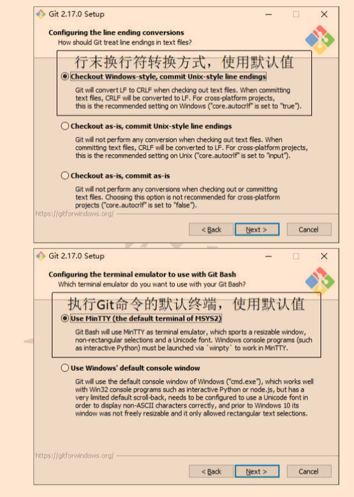
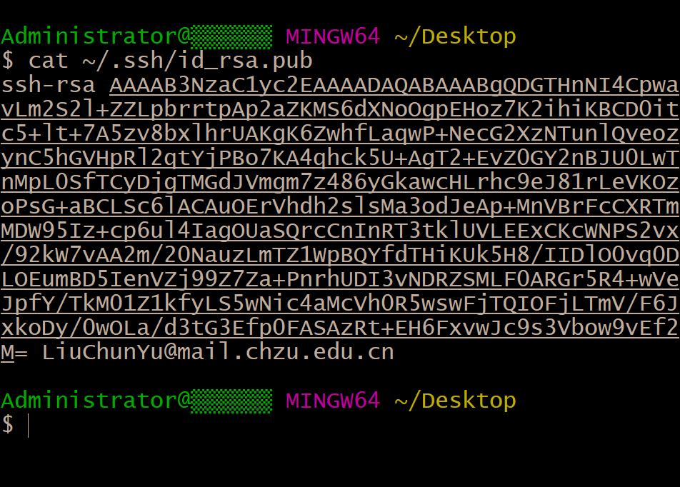

#                                                                  Git


## Git简介

Git是目前世界上最先进的分布式版本控制系统。客户端并不只是提取最新版本的文件快照，而是把代码仓库完整地镜像下来。分布式的版本控制系统在管理项目时，存放的不是项目版本与版本之间的差异。它存的是索引（所需磁盘空间很少，所以每个客户端都可以放下整个项目的历史记录）


## Git结构


## Git安装与配置

#### Git安装

##### 1.进入官网  

 https://git-scm.com/  （下载较慢）  https://cloud.189.cn/t/ia2IvqMnUfaq（下载较快）


##### 2.下载  


##### 3.安装

默认选项安装即可。可参考下图安装或观看视频安装（https://cloud.189.cn/t/aYjuyuURzqM3）





#### 配置Git用户名与地址 

##### 			配置目的  

​			Git是分布式版本管理工具，需要每一个使用者提供个人信息，留下个人联系方式便于别的开发者联系 


##### 			配置方法	

```
//设置用户姓名
　　git config --global user.name "姓名"
//设置可以联系的邮箱地址
　　git config --global user.email "联系邮箱"　
// 查看设置信息
   git config --global --list
```


#### 配置ssh密钥

##### 				配置目的

​				节省输入用户名密码的过程，同时保证传输安全


##### 				配置方法

###### 				创建本地SSH密钥

​				`ssh-keygen -t rsa -C "GitHub账户" `  


  

###### 				获取本地SSH密钥

​				`cat ~/.ssh/id_rsa.pub`  




###### 				GitHub账户中添加SSH密钥


## 命令行中Git操作

#### 创建本地版本库

  1.在本机中选择一个合适的地方，创建一个空目录      `mkdir  目录名`   。

2. 使用`cd  目录名` 命令进入新创建的目录  ，使用 `git init`命令将这个目录变成Git可以管理的仓库。此仓库下有一个隐藏的 .git 目录，其中存放的是本地库相关的子目录和文件，不要删除，也不要胡乱修改。
3. 使用 `git add 文件名`  命令将工作区的文件“新建/修改”添加到暂存区。注意：工作区的文件一定要放在Git仓库中，否则无法找到文件。
4. 使用 `git  commit  -m "提示内容" 文件名   ` 命令将暂存区的内容提交到本地库，当你省略文件名时，默认调教暂存区中所有的文件到本地库。
5. 使用 `git status` 命令查看工作区和暂存区状态


####   添加远程库


在Git中使用快捷名保存并调用此地址

`git remote add  快捷名 https/ssh地址`


查看保存的快捷名及弟子

`gir remote -v`  


远程库中添加本地库  

`git  push  -u  快捷名  分支名`


`git remote add origin `


## WebStorm中Git操作

#### 本地克隆远程库

​		一：VSC -> 从版本控制中获取 


​		

​		二：URL中填写远程库的HTTPS或者SSH, 目录是本地存储克隆的远程库的位置


#### 创建本地版本库

##### 		初始化本地库


#####        添加到暂存区


#####       提交到本地库


#### 创建GitHub远程库

#####     创建远程库


注：   创建远程库之后，会自动为当前项目创建本地库，并询问你是否将当前项目导入到远程库中


##### GitHub中查看远程库


##### 本地库提交到远程库

###### 方法一


注：只能提交本地库中的内容，暂存区的无法提交。


###### 方法二


注：只能提交本地库中的内容，暂存区的无法提交。


## Git的其他基本操作：  

####   查看工作区，暂存区状态 

  `git status`  


####   查看历史记录

#####             查看文件历史记录:  

​										`git  log`   

#####             查看命令历史记录:

​										 `git reflog`


####   比较文件差异

 `git diff 文件名`         


####   切换版本  

 `git  reset --hard  索引值  `     


####   回退

##### 				工作区回退：

​				回退到并与版本库最新版本一致  `git checkout` -- 文件名 

​				注：checkout就是用版本库中的版本，替换工作区中的版本，所以无论工作区是删除还是修改，都可以用checkout一键还原

##### 				暂存区回退:   

​				回退到并与版本库最新版本一致 `git reset HEAD <file>`    `git checkout -- file`


## 分支管理

####      分支解释

​			在版本控制过程中，使用多条线同时推进多个任务。Git分支管理的本质是创建和移动指针


#### 分支操作

##### 			创建分支： 

 						`git  branch   分支名`


##### 			查看分支：

​						 `git  branch  -v`


##### 			切换分支：

​							`git  checkout   分支名`

  			 			`git  switch  分支名`


#####            创建并切换分支：

​						 `git checkout -b 分支名`

​						 `git switch -c 分支名`


##### 			合并分支：

###### 					合并某分支到当前分支

​								第一步：	切换到当前分支上

​								第二部：   使用  `git merge 合并的某分支`  命令


##### 			解决冲突：

######  						 冲突的表现

​										Git用`<<<<<<<`，`=======`，`>>>>>>>`标记出不同分支的内容

###### 						 冲突的解决

​											将Git合并失败的文件手动编辑为我们希望的内容

​											第一步： 编辑文件，删除特殊符号

​											第二步： 把文件修改到满意的程度，保存退出

​											第三步： `git  add  文件名`	

​											第四步： `git commit -m "日志信息"`		注： 此时commit一定不能带文件名


​	


